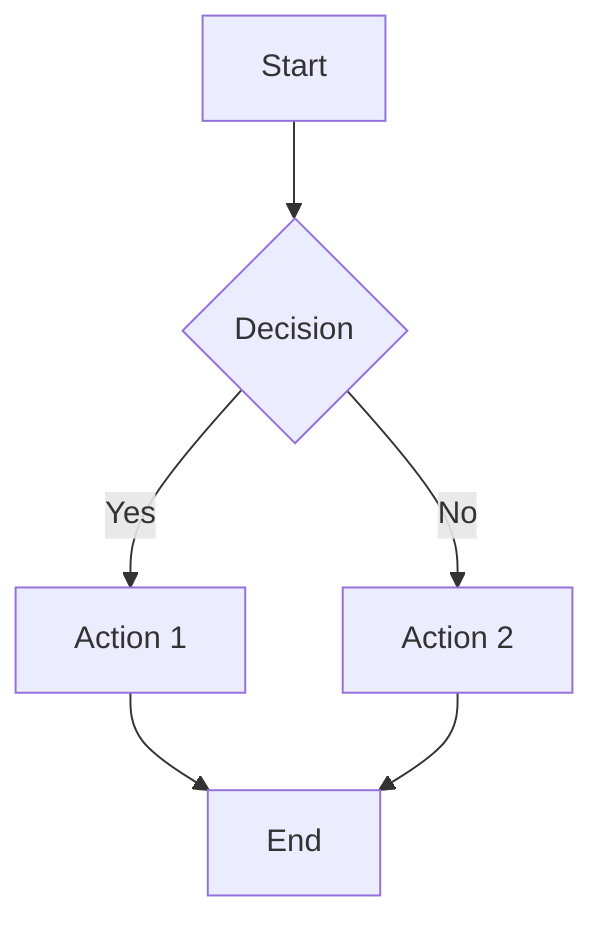

# Diagram Template

## Mermaid Diagram Template


## ASCII Diagram Template
```
+---------------------+
|    System Block     |
|                     |
|  +---------------+  |
|  |  Subsystem    |  |
|  +---------------+  |
+---------------------+
```

## Diagram Requirements
- Caption: {Description of what the diagram illustrates}
- Alt Text: {Accessibility description for screen readers}
- Related Concepts: {List of concepts illustrated by this diagram}